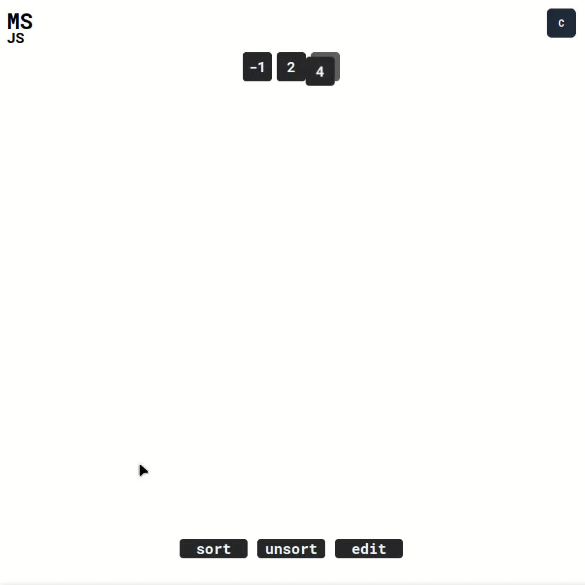

# MS.js | By navegaohack
# Merge Sort algorithm visualization app
### inspired in Antonio Sarosi's Merge Sort project

| App preview |
|:---:|
| |

You can experiment, and PR new feature^

## Controls

| controls | Functionalities |
| ------------- |:-------------:|
| sort | Sort the current array |
| unsort | Unsort the current array |
| edit | edit the current array |
| p | previous node (on edit mode) |
| m | increment value (more) (on edit mode) |
| l | decrement value (less) (on edit mode) |
| n | next node (on edit mode) |
| C | Aside menu |
| click on a previous array | set the array selected as current array |
| input array | set the array writed as current array automatically |

Thanks for download and test ;D
